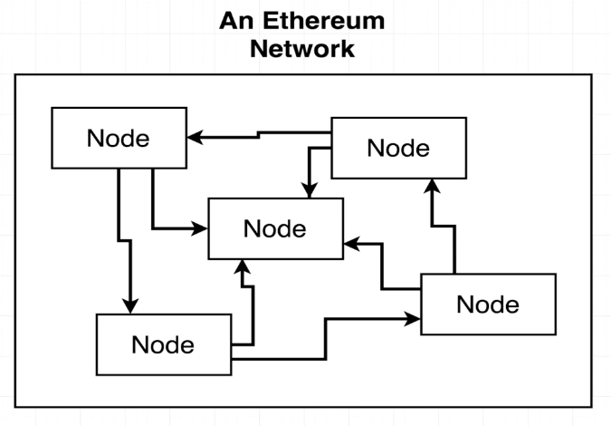
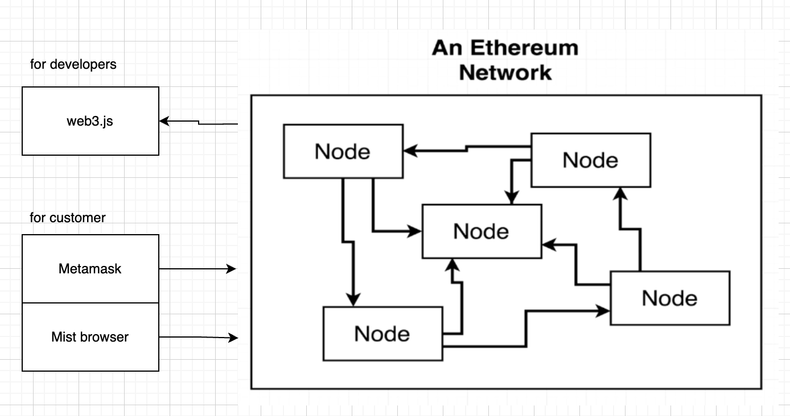
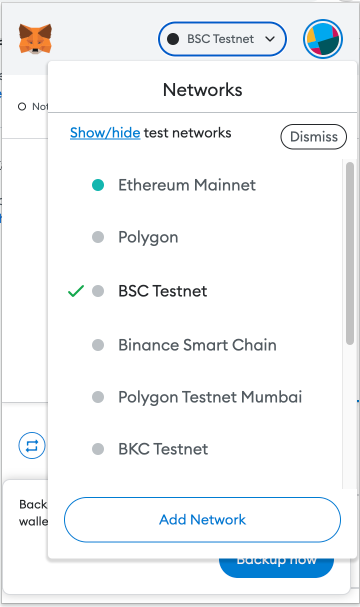
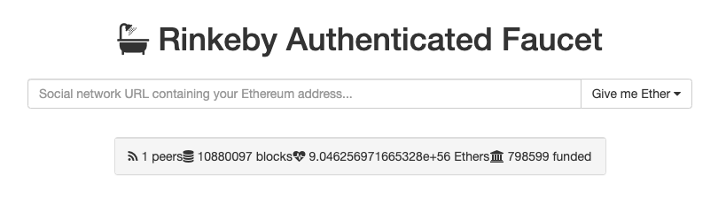
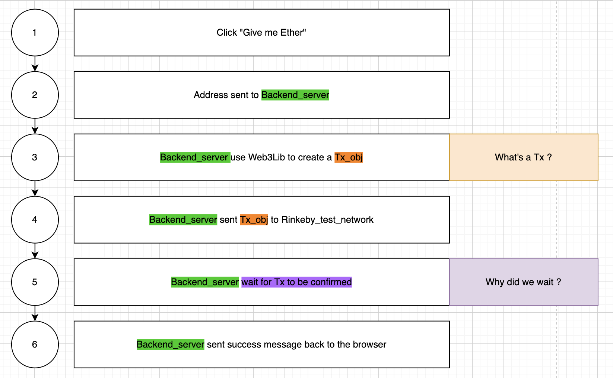
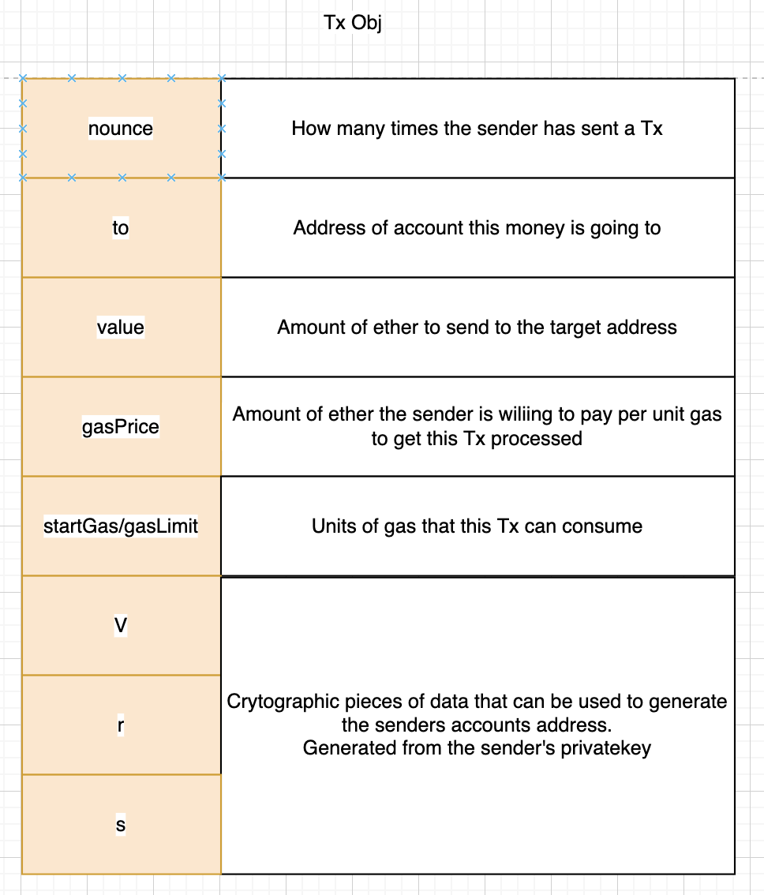
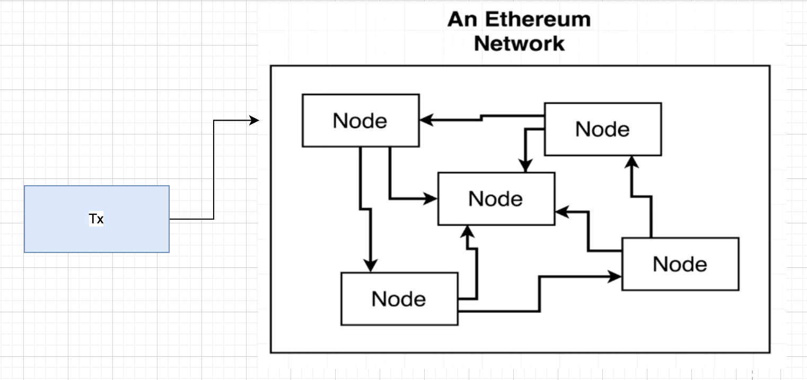
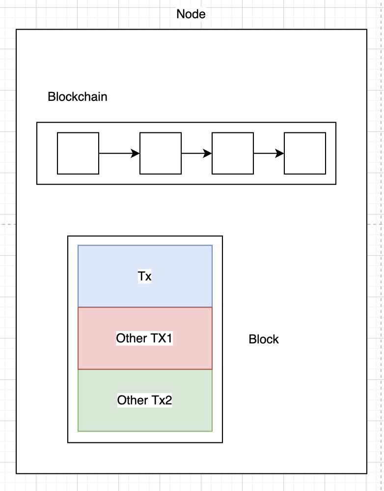

# ETH network

- Objective: ถูกสร้างมาเพื่อใช้ในการ transfer money และ store data

- มีทั้ง mainnet และ testnet

- Network ประกอบไปด้วย 1 หรือ more nodes

- แต่ละ node ก็คือเครื่องคอมที่ run etherium client

- ใครก็สามารถ run node ได้

- แต่ละ node ประกอบด้วย full copy of the blockchain

- Blockchain ก็คือ database ที่ store record ของทุกๆ Tx

# Interface with ETH Network

Interface roles

- Dev => use web3js to communicate with ETH_Network

- Customer => use Metamas to communitacte with ETH_Network

# ETH Account

Using metamask Extension

Metask mask ประกอบไปด้วย

- Account Address ex: 0xcf7...c20

- Public key ex: 0x3837...dc8c

- Private key ex: 0x1b...1a3

- metamask มีได้หลาย account (ใน 1 กระเป๋า มีช่องหลายๆช่อง)

- แต่ละ account ต่อได้หลาย network

  - mainnet

  - Ropsten testnet

  - Kovan testnet

  - Rinkeby testnet

  - localhost:8485

\*account เดิม แต่คนละ network จะเป็นเลข account address เดิมนะ

# Receiving ETH with Faucet

## How is Faucet work?

## Tx obj คือ ?

## Why we wait?

เหตุผลที่เราต้องรอเพราะ ตอนส่ง Tx เข้าไปใน network

Tx จะถูกส่งเข้าที่ node ๆ นึง อย่าลืมว่า node ไม่ได้รับแค่ Tx เดียว

Node จะทำการสร้าง Block โดยรวม lists of Tx

เมื่อเติม Tx ลง block แล้ว จะทำการ validation block ด้วย validation_logic หรือที่เรียกกันว่า "Mining" นั่นเอง

\*ซึ่งการ validation_logic(minig) บน ETH_network จะใช้เวลา 30s
